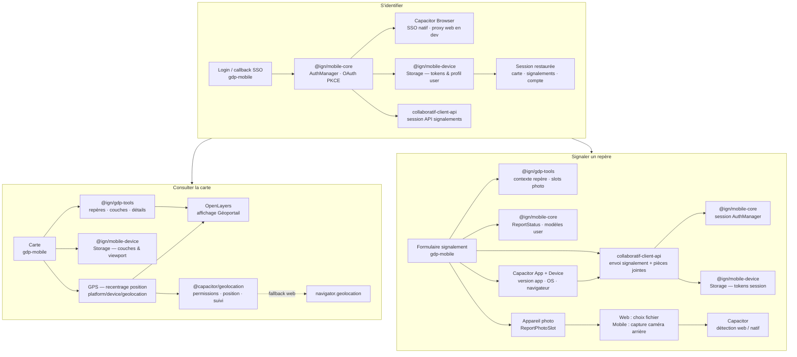

# Architecture — gdp-mobile

## Couches `src/`

```
app/ → features/ → infra/ → platform/ → domain/
         ↓
      shared/ + styles/
```

| Couche | Rôle |
|--------|------|
| `domain/` | Modèles purs, sans React ni réseau |
| `infra/` | Auth, API collaboratif, OpenLayers, stockage |
| `platform/` | Wrappers `@ign/mobile-device` / Capacitor |
| `features/` | Hooks et composants métier |
| `pages/` | Écrans routés (fine couche) |
| `shared/` | UI, config, constantes, utils |

## Dépendances externes

- `@ign/gdp-tools` : catalogues WMS/WFS, GetFeatureInfo, hooks carte, signalements repère
- `@ign/mobile-core` : `AuthManager`, OAuth PKCE, modèles (`User`, `ReportStatus`)
- `@ign/mobile-device` : persistance locale (`Storage`) — tokens, profil, préférences carte
- `collaboratif-client-api` : signalements et communautés
- `OpenLayers` + `ol-ext` : carte Géoportail
- `Capacitor` : SSO natif, géolocalisation, métadonnées appareil (phase mobile)

## Flux utilisateur



| Flux | `@ign/mobile-core` | `@ign/mobile-device` | Capacitor |
|------|--------------------|----------------------|-----------|
| **Identification** | `AuthManager`, OAuth PKCE, modèle `User` | Persistance tokens & profil | `Browser` (SSO natif) |
| **GPS / carte** | — | Préférences carte (couches, viewport) | `Geolocation` (+ fallback navigateur) |
| **Signalement + photo** | Session API, `ReportStatus` | Tokens pour l'API | `App` / `Device` (métadonnées) ; caméra via `<input capture>` |

Notes :

- **Identification** : requise pour signaler et accéder au compte ; la carte reste consultable sans connexion (écrans protégés via `AuthGuard`).
- **GPS** : bouton de recentrage sur la carte ; wrapper `Gdp_Geolocation` dans `platform/device/` — pas de logique GPS dans `@ign/mobile-core`.
- **Appareil photo** : pas de plugin Capacitor Camera dédié ; en natif, `<input type="file" accept="image/*" capture="environment">` ouvre la caméra ou la galerie. Vérification de l'orientation paysage côté app avant envoi.

## Routes MVP

| Route | Écran |
|-------|-------|
| `/` | Redirect → `/map` ou `/welcome` |
| `/map` | Carte (écran central) — fiche point au clic sur un repère ([détail](./FICHE_POINT.md)) |
| `/report/geodesy/new` | Signalement repère |
| `/login`, `/auth/callback` | SSO |

Voir `cursor_nouvelle_application_g_od_sie_de.md` pour le plan complet.

## Documentation métier carte

- [Fiche point](./FICHE_POINT.md) — bottom sheet, snaps, variantes géodésie/nivellement, carrousel, mode debug champs
