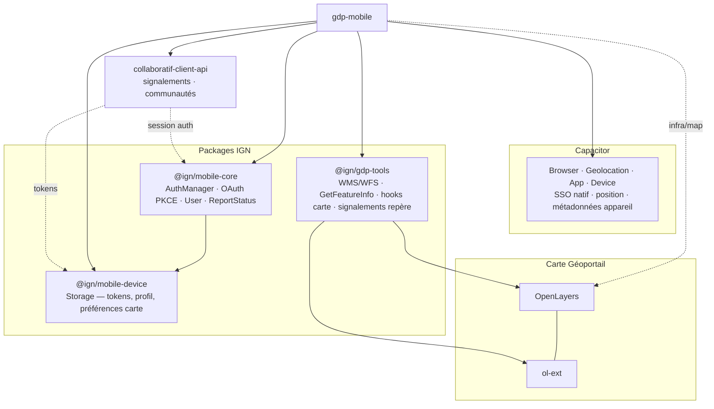
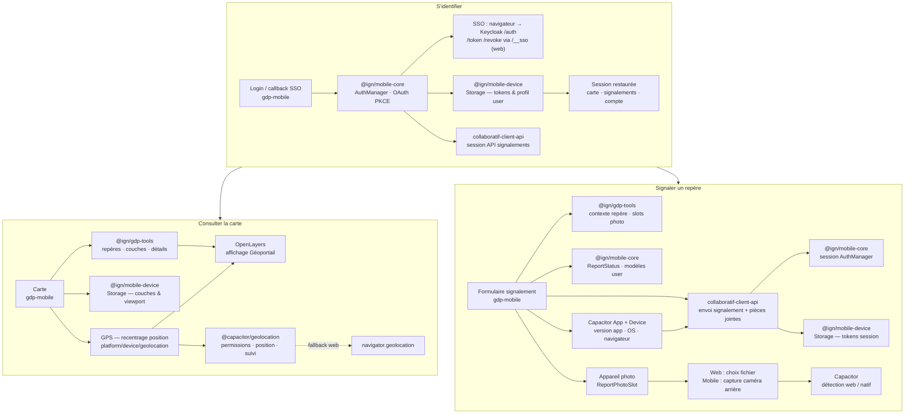

# Architecture — gdp-mobile

## Couches `src/`

```
app/ → features/ → infra/ → platform/ → domain/
         ↓
      shared/ + styles/
```

| Couche | Rôle |
|--------|------|
| `domain/` | Modèles purs, sans React ni réseau (imports de **types** `@ign/gdp-tools` acceptés) |
| `infra/` | Auth, API collaboratif, OpenLayers, stockage |
| `platform/` | Wrappers `@ign/mobile-device` / Capacitor |
| `features/` | Hooks et composants métier |
| `pages/` | Écrans routés (fine couche) |
| `shared/` | UI, config, constantes, utils |

## Dépendances externes

- `@ign/gdp-tools` : catalogues WMS/WFS, GetFeatureInfo, hooks carte, signalements repère
- `@ign/mobile-core` : `AuthManager`, OAuth PKCE, modèles (`User`, `ReportStatus`)
- `@ign/mobile-device` : persistance locale (`Storage`) — tokens, profil, préférences carte
- `collaboratif-client-api` : signalements et communautés
- `OpenLayers` + `ol-ext` : carte Géoportail
- `Capacitor` : SSO natif, géolocalisation, métadonnées appareil


```mermaid
flowchart TB
  APP["gdp-mobile"]

  subgraph ign["Packages IGN"]
    direction TB
    GDP["@ign/gdp-tools<br/>WMS/WFS · GetFeatureInfo · hooks carte · signalements repère"]
    MC["@ign/mobile-core<br/>AuthManager · OAuth PKCE · User · ReportStatus"]
    MD["@ign/mobile-device<br/>Storage — tokens, profil, préférences carte"]
    MC --> MD
  end

  CC["collaboratif-client-api<br/>signalements · communautés"]

  subgraph cap["Capacitor"]
    CAP["Browser · Geolocation · App · Device<br/>SSO natif · position · métadonnées appareil"]
  end

  subgraph carte["Carte Géoportail"]
    direction LR
    OL["OpenLayers"]
    OLE["ol-ext"]
    OL --- OLE
  end

  APP --> GDP
  APP --> MC
  APP --> MD
  APP --> CC
  APP --> CAP
  APP -.->|"infra/map"| OL

  GDP --> OL
  GDP --> OLE

  CC -.->|"session auth"| MC
  CC -.->|"tokens"| MD

  cap ~~~ carte
  CC ~~~ carte
```

## Flux utilisateur


```mermaid
flowchart TB
  subgraph identifier["S'identifier"]
    I1["Login / callback SSO<br/>gdp-mobile"] --> I2["@ign/mobile-core<br/>AuthManager · OAuth PKCE"]
    I2 --> I3["SSO : navigateur → Keycloak /auth<br/>/token /revoke via /__sso (web)"]
    I2 --> I4["@ign/mobile-device<br/>Storage — tokens & profil user"]
    I4 --> I5["Session restaurée<br/>carte · signalements · compte"]
    I2 --> I6["collaboratif-client-api<br/>session API signalements"]
  end

  subgraph consulter["Consulter la carte"]
    A1["Carte<br/>gdp-mobile"] --> A2["@ign/gdp-tools<br/>repères · couches · détails"]
    A2 --> A3["OpenLayers<br/>affichage Géoportail"]
    A1 --> A4["@ign/mobile-device<br/>Storage — couches & viewport"]
    A1 --> A5["GPS — recentrage position<br/>platform/device/geolocation"]
    A5 --> A6["@capacitor/geolocation<br/>permissions · position · suivi"]
    A6 -.->|"fallback web"| A7["navigator.geolocation"]
    A5 --> A3
  end

  subgraph signaler["Signaler un repère"]
    B1["Formulaire signalement<br/>gdp-mobile"] --> B2["@ign/gdp-tools<br/>contexte repère · slots photo"]
    B1 --> B3["collaboratif-client-api<br/>envoi signalement + pièces jointes"]
    B3 --> B4["@ign/mobile-core<br/>session AuthManager"]
    B3 --> B5["@ign/mobile-device<br/>Storage — tokens session"]
    B1 --> B6["@ign/mobile-core<br/>ReportStatus · modèles user"]
    B1 --> B7["Appareil photo<br/>ReportPhotoSlot"]
    B7 --> B8["Web : choix fichier<br/>Mobile : capture caméra arrière"]
    B8 --> B9["Capacitor<br/>détection web / natif"]
    B1 --> B10["Capacitor App + Device<br/>version app · OS · navigateur"]
    B10 --> B3
  end

  identifier --> consulter
  identifier --> signaler
```

| Flux | `@ign/mobile-core` | `@ign/mobile-device` | Capacitor |
|------|--------------------|----------------------|-----------|
| **Identification** | `AuthManager`, OAuth PKCE, modèle `User` | Persistance tokens & profil | `Browser` (SSO natif) |
| **GPS / carte** | — | Préférences carte (couches, viewport) | `Geolocation` (+ fallback navigateur) |
| **Signalement + photo** | Session API, `ReportStatus` | Tokens pour l'API | `App` / `Device` (métadonnées) ; caméra via `<input capture>` |

Notes :

- **Identification** : requise pour envoyer un signalement et consulter le compte ; la carte reste consultable sans connexion. Pas de garde de route globale : les pages `/reports` s’adaptent à `useAuth()` (brouillons locaux vs signalements serveur). En **web**, `/token` et `/revoke` passent par `/__sso` (Vite en local, Apache `ProxyPass` en qualif) pour rester same-origin ; la page de login Keycloak n’est pas proxifiée. En **natif**, `AuthManager` parle à `VITE_OAUTH_BASE_URL`. Voir [README — Apache qualif](../README.md#apache-sur-le-serveur-de-qualif) et [Dépannage](./DEPANNAGE.md).
- **GPS** : bouton de recentrage sur la carte ; wrapper dans `platform/device/` — pas de logique GPS dans `@ign/mobile-core`.
- **Appareil photo** : pas de plugin Capacitor Camera dédié ; en natif, `<input type="file" accept="image/*" capture="environment">` ouvre la caméra ou la galerie. Vérification de l'orientation paysage côté app avant envoi.

## Routes

| Route | Écran |
|-------|-------|
| `/` | Redirect → `/welcome` (premier lancement), sinon `/login` ou `/map` selon `VITE_AUTH_REQUIRED` |
| `/welcome` | Onboarding |
| `/login`, `/auth/callback` | SSO |
| `/map` | Carte — fiche point au clic ([détail](./FICHE_POINT.md)) ; wizard de signalement en overlay |
| `/reports` | Mes signalements (brouillons locaux + envoyés si connecté) |
| `/reports/:id` | Détail d’un brouillon / signalement |
| `/reports/history`, `/reports/history/:id` | Historique communauté |

Compte, paramètres, aide, à propos, favoris et communauté sont des **overlays** (`SlideUpPage`) ouverts depuis le menu latéral, pas des routes du router.

## Documentation métier carte

- [Fiche point](./FICHE_POINT.md) — bottom sheet, snaps, variantes géodésie/nivellement, carrousel, mode debug champs
